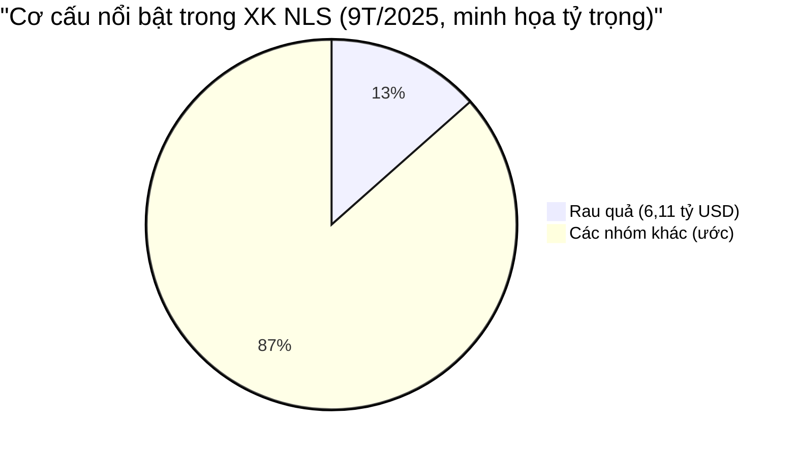

<!-- ===== Tooltip styles (AgriS green) ===== -->
<style>
.tip{position:relative;display:inline-block;cursor:help;margin-left:.2rem;vertical-align:super;font-weight:700;color:#047857;background:#ecfdf5;border:1px solid #34d399;border-radius:4px;padding:0 5px;font-size:.75em;line-height:1}
.tip:hover .tiptext{visibility:visible;opacity:1;transform:translate(-50%,-6px)}
.tip .tiptext{visibility:hidden;opacity:0;transition:all .2s ease;position:absolute;left:50%;bottom:1.6rem;min-width:280px;max-width:340px;background:#064e3b;color:#ecfdf5;border:1px solid #10b981;border-radius:8px;padding:.6rem .75rem;box-shadow:0 8px 24px rgba(0,0,0,.25);z-index:20;font-size:.9rem;line-height:1.45}
.tip .tiptext a{color:#6ee7b7;text-decoration:underline;word-break:break-all}
.badge{display:inline-block;background:#ecfdf5;color:#065f46;border:1px solid #10b981;padding:.15rem .5rem;border-radius:999px;font-weight:600;font-size:.8rem;margin-left:.25rem}
.kpi{border-collapse:collapse;width:100%}
.kpi th,.kpi td{border:1px solid #d1fae5;padding:.55rem .6rem}
.kpi th{background:#ecfdf5;color:#065f46;text-align:left}
.section{border-left:6px solid #10b981;background:#f0fdf4;padding:1rem;border-radius:.75rem}
</style>

## 🧭 Executive Snapshot

- **PMI sản xuất (T9): 50,4 điểm** <span class="tip">[i]<span class="tiptext">Nguồn: VnEconomy (02/10/2025). <a href="https://vneconomy.vn/nganh-san-xuat-viet-nam-cai-thien-nhe-trong-thang-9-so-luong-don-hang-moi-tang-tro-lai.htm" target="_blank">Xem</a></span></span> — tiếp tục trên ngưỡng mở rộng.
- **Thương mại 9T/2025:** Tổng XNK **637,22 tỷ USD**, **thặng dư 13,31 tỷ USD** <span class="tip">[i]<span class="tiptext">Nguồn: Tổng cục Hải quan (truy cập 02/10/2025). <a href="http://customs.gov.vn:8228/index.jsp?pageId=445" target="_blank">Xem</a></span></span>.
- **Xuất khẩu NLS (8T): 45,37 tỷ USD (+12%)** <span class="tip">[i]<span class="tiptext">Nguồn: ISPAE (02/10/2025). <a href="https://ispae.vn/vn/tID13178_xuat-khau-nong-lam-thuy-san-thang-82025-tang-toc-manh-nhieu-thach-thuc.html" target="_blank">Xem</a></span></span>.  
  **Rau quả (9T): 6,11 tỷ USD (+8,3%)** <span class="tip">[i]<span class="tiptext">Nguồn: Báo Hải Phòng; Nhân Dân (02/10/2025). <a href="https://baohaiphong.vn/xuat-khau-rau-qua-trong-9-thang-nam-2025-dat-hon-6-ty-usd-522104.html" target="_blank">Xem 1</a> · <a href="https://nhandan.vn/xuat-khau-rau-qua-dat-hon-6-ty-usd-trong-9-thang-dau-nam-2025-post911319.html" target="_blank">Xem 2</a></span></span>.
- **Thời tiết cực đoan:** 4 cơn bão liên tiếp; **Bão số 10 (Bualoi)** gây thiệt hại **~8.016 tỷ đồng** ước tính <span class="tip">[i]<span class="tiptext">Nguồn: Chính phủ; Công lý; Nhân Dân (02/10/2025). <a href="https://baochinhphu.vn/thu-tuong-chi-dao-tap-trung-khac-phuc-nhanh-hau-qua-bao-so-10-va-mua-lu-102251002021745459.htm" target="_blank">Xem 1</a> · <a href="https://congly.vn/thiet-hai-do-con-bao-so-10-bualoi-gay-ra-uoc-tinh-khoang-8-016-ty-dong-494725.html" target="_blank">Xem 2</a> · <a href="https://nhandan.vn/cap-nhat-toan-canh-bao-so-10-bualoi-do-bo-khien-24-nguoi-chet-va-mat-tich-8-nguoi-dang-mat-lien-lac-post911116.html" target="_blank">Xem 3</a></span></span>.
- **Đường:** Giá đường thô **~16,40 c/lb (No.11)** — rủi ro co hẹp biên lợi nhuận; **đang rà soát cuối kỳ** biện pháp phòng vệ với đường Thái Lan (ER01.AD13-AS01) <span class="tip">[i]<span class="tiptext">Nguồn: HCT; MOIT (02/10/2025). <a href="https://hct.vn/tin-tuc/gia-duong-the-gioi-cap-nhat-gia-truc-tuyen-lien-tuc-1570" target="_blank">Giá đường</a> · <a href="https://moit.gov.vn/tin-tuc/thi-truong-nuoc-ngoai/tieu-de-bo-cong-thuong-ban-hanh-quyet-dinh-ra-soat-cuoi-ky-viec-ap-dung-bien-phap-chong-ban-pha-gia-va-chong-tro-cap-doi.html" target="_blank">Rà soát</a></span></span>.
- **Gạo:** 8T/2025 sản lượng XK **+2,2%**, **giá trị −17,5%**, **giá XK bình quân −19,3%**; Philippines **tạm dừng NK 60 ngày từ 01/9** <span class="tip">[i]<span class="tiptext">Nguồn: Công Thương; VnEconomy (02/10/2025). <a href="https://congthuong.vn/gia-lua-gao-hom-nay-ngay-28-9-va-tuan-qua-thi-truong-tram-lang-422760.html" target="_blank">Xem 1</a> · <a href="https://vneconomy.vn/xuat-khau-gao-doi-mat-voi-thach-thuc-moi.htm" target="_blank">Xem 2</a></span></span>.
- **Dừa:** Giá dừa khô ĐBSCL **~215.000 đ/chục** (cao kỷ lục; ~x3 so với cùng kỳ) <span class="tip">[i]<span class="tiptext">Nguồn: VN Food Pharm (30/09/2025). <a href="https://vnfoodpharmco.com/gia-dua-kho-hom-nay/" target="_blank">Xem</a></span></span>.  
- **Chuối:** Xuất khẩu tăng mạnh, thị phần tại Trung Quốc cải thiện; giá tại vườn **7.500–9.000 đ/kg** <span class="tip">[i]<span class="tiptext">Nguồn: Báo Chính phủ; Airnano (02/10/2025). <a href="https://baochinhphu.vn/chuoi-viet-nam-dan-dau-thi-phan-tai-trung-quoc-tien-gan-cau-lac-bo-ty-usd-102250814104254559.htm" target="_blank">Xem 1</a> · <a href="https://airnano.vn/gia-chuoi/" target="_blank">Xem 2</a></span></span>.

> **Hàm ý chiến lược (điểm tin, không phải kế hoạch):**  
> Bảo vệ “pháo đài” đường (policy risk), đẩy nhanh danh mục **F&B thiên nhiên (dừa/chuối)**, chủ động **MRV carbon** cho giai đoạn thí điểm.

---

## 📊 KPI nổi bật

<table class="kpi">
  <tr>
    <th>Chỉ tiêu</th><th>Giá trị</th><th>Ghi chú / Nguồn</th>
  </tr>
  <tr>
    <td>Tổng XNK 9T</td>
    <td><strong>637,22 tỷ USD</strong></td>
    <td>Hải quan <span class="tip">[i]<span class="tiptext"><a href="http://customs.gov.vn:8228/index.jsp?pageId=445" target="_blank">Link</a></span></span></td>
  </tr>
  <tr>
    <td>Thặng dư TM 9T</td>
    <td><strong>13,31 tỷ USD</strong></td>
    <td>Hải quan <span class="tip">[i]<span class="tiptext"><a href="http://customs.gov.vn:8228/index.jsp?pageId=445" target="_blank">Link</a></span></span></td>
  </tr>
  <tr>
    <td>PMI Sản xuất (T9)</td>
    <td><strong>50,4 điểm</strong></td>
    <td>VnEconomy <span class="tip">[i]<span class="tiptext"><a href="https://vneconomy.vn/nganh-san-xuat-viet-nam-cai-thien-nhe-trong-thang-9-so-luong-don-hang-moi-tang-tro-lai.htm" target="_blank">Link</a></span></span></td>
  </tr>
  <tr>
    <td>XK Nông lâm thủy sản (8T)</td>
    <td><strong>45,37 tỷ USD</strong> <span class="badge">+12%</span></td>
    <td>ISPAE <span class="tip">[i]<span class="tiptext"><a href="https://ispae.vn/vn/tID13178_xuat-khau-nong-lam-thuy-san-thang-82025-tang-toc-manh-nhieu-thach-thuc.html" target="_blank">Link</a></span></span></td>
  </tr>
  <tr>
    <td>XK Rau quả (9T)</td>
    <td><strong>6,11 tỷ USD</strong> <span class="badge">+8,3%</span></td>
    <td>Báo Hải Phòng / Nhân Dân <span class="tip">[i]<span class="tiptext"><a href="https://baohaiphong.vn/xuat-khau-rau-qua-trong-9-thang-nam-2025-dat-hon-6-ty-usd-522104.html" target="_blank">1</a> &nbsp; <a href="https://nhandan.vn/xuat-khau-rau-qua-dat-hon-6-ty-usd-trong-9-thang-dau-nam-2025-post911319.html" target="_blank">2</a></span></span></td>
  </tr>
  <tr>
    <td>Giá đường thô No.11</td>
    <td><strong>~16,40 c/lb</strong></td>
    <td>HCT <span class="tip">[i]<span class="tiptext"><a href="https://hct.vn/tin-tuc/gia-duong-the-gioi-cap-nhat-gia-truc-tuyen-lien-tuc-1570" target="_blank">Link</a></span></span></td>
  </tr>
  <tr>
    <td>Giá dừa khô ĐBSCL</td>
    <td><strong>~215.000 đ/chục</strong></td>
    <td>VN Food Pharm <span class="tip">[i]<span class="tiptext"><a href="https://vnfoodpharmco.com/gia-dua-kho-hom-nay/" target="_blank">Link</a></span></span></td>
  </tr>
  <tr>
    <td>Giá chuối tại vườn</td>
    <td><strong>7.500–9.000 đ/kg</strong></td>
    <td>Airnano <span class="tip">[i]<span class="tiptext"><a href="https://airnano.vn/gia-chuoi/" target="_blank">Link</a></span></span></td>
  </tr>
</table>

---

## 📈 Biểu đồ



```mermaid
%% So sánh chỉ số gạo 8T/2025 (Index = 100 tại cùng kỳ 2024)
bar
  title: "Gạo: Sản lượng vs Giá trị vs Giá XK bình quân (Index)"
  x-axis: Chỉ số
  y-axis: Điểm
  series:
    - title: Sản lượng
      data: 102.2
    - title: Giá trị
      data: 82.5
    - title: Giá XK BQ
      data: 80.7
```

```mermaid
%% Giá tham chiếu (minh họa quy đổi VNĐ/kg từ c/lb) + nội địa
bar
  title: "Đường: Thế giới (No.11) vs Nội địa (ước) — VNĐ/kg"
  x-axis: Hạng mục
  y-axis: VNĐ/kg
  series:
    - title: No.11 ~16,4 c/lb (ước)
      data: 10200
    - title: Nội địa wholesale (ước)
      data: 21000
```

> Lưu ý: Biểu đồ “ước”/“minh họa” dùng để trực quan hóa tương quan (không thay thế báo giá giao dịch).

---

## 🌾 Điểm nhấn theo ngành hàng

### 1) **Đường** — *biến số chính sách là tâm điểm*
- Giá thế giới duy trì thấp; rà soát cuối kỳ biện pháp CBPG/CTC với đường Thái Lan (ER01.AD13-AS01) là **biến số quyết định** cục diện 2025–2026  
  <span class="tip">[i]<span class="tiptext">MOIT; HCT (02/10/2025). <a href="https://moit.gov.vn/tin-tuc/thi-truong-nuoc-ngoai/tieu-de-bo-cong-thuong-ban-hanh-quyet-dinh-ra-soat-cuoi-ky-viec-ap-dung-bien-phap-chong-ban-pha-gia-va-chong-tro-cap-doi.html" target="_blank">Rà soát</a> · <a href="https://hct.vn/tin-tuc/gia-duong-the-gioi-cap-nhat-gia-truc-tuyen-lien-tuc-1570" target="_blank">Giá</a></span></span>.  
- **Hàm ý:** Duy trì “cấu trúc phòng thủ” biên lợi nhuận; chủ động dữ liệu và tham vấn chính sách qua hiệp hội.

### 2) **Phân bón** — *mặt bằng giá cao ổn định*
- Urê **610–660k**, Kali **490–580k**, NPK **650–750k** (bao 50kg) — duy trì cao (tổng hợp thị trường).  
- **Hàm ý:** Mở rộng/đẩy nhanh mảng **phân bón hữu cơ** để giảm chi phí đầu vào và nâng chuẩn bền vững vùng nguyên liệu.

### 3) **Lúa gạo** — *“được mùa, mất giá”*
- Sản lượng tăng nhưng **giá trị và giá XK bình quân giảm sâu**; Philippines **tạm dừng NK 60 ngày** từ 01/9 → thị trường nội địa trầm lắng  
  <span class="tip">[i]<span class="tiptext">Công Thương; VnEconomy (02/10/2025). <a href="https://congthuong.vn/gia-lua-gao-hom-nay-ngay-28-9-va-tuan-qua-thi-truong-tram-lang-422760.html" target="_blank">Xem 1</a> · <a href="https://vneconomy.vn/xuat-khau-gao-doi-mat-voi-thach-thuc-moi.htm" target="_blank">Xem 2</a></span></span>.  
- **Hàm ý:** Tập trung **gạo chất lượng cao/hữu cơ** & **chế biến sâu** để tránh cạnh tranh giá thuần.

### 4) **Dừa & Chuối** — *đà tăng giá trị cao*
- Dừa khô ĐBSCL **~215k/chục**, mức cao hiếm có <span class="tip">[i]<span class="tiptext">VN Food Pharm (30/09/2025). <a href="https://vnfoodpharmco.com/gia-dua-kho-hom-nay/" target="_blank">Xem</a></span></span>.  
- Chuối củng cố thị phần tại Trung Quốc; giá vườn **7.5–9k/kg** <span class="tip">[i]<span class="tiptext">Báo Chính phủ; Airnano (02/10/2025). <a href="https://baochinhphu.vn/chuoi-viet-nam-dan-dau-thi-phan-tai-trung-quoc-tien-gan-cau-lac-bo-ty-usd-102250814104254559.htm" target="_blank">Xem 1</a> · <a href="https://airnano.vn/gia-chuoi/" target="_blank">Xem 2</a></span></span>.  
- **Hàm ý:** Tận dụng “cửa sổ giá” để **đẩy mạnh F&B thiên nhiên** (nước dừa, nước mía, snack trái cây).

### 5) **Rủi ro thiên tai & Logistics**
- **4 bão liên tiếp** trong tháng; **Bão 10** gây thiệt hại nặng và rủi ro gián đoạn chuỗi cung ứng  
  <span class="tip">[i]<span class="tiptext">Nhân Dân; Chính phủ; MAE (02/10/2025). <a href="https://nhandan.vn/cap-nhat-toan-canh-bao-so-10-bualoi-do-bo-khien-24-nguoi-chet-va-mat-tich-8-nguoi-dang-mat-lien-lac-post911116.html" target="_blank">Xem 1</a> · <a href="https://baochinhphu.vn/thu-tuong-chi-dao-tap-trung-khac-phuc-nhanh-hau-qua-bao-so-10-va-mua-lu-102251002021745459.htm" target="_blank">Xem 2</a> · <a href="https://www.mae.gov.vn/khi-tuong-thuy-van/tu-nay-den-cuoi-nam-2025-con-nhieu-dot-bao-mua-to-keo-dai-19045.htm" target="_blank">Xem 3</a></span></span>.  
- **Hàm ý:** Cần năng lực **dự báo – ứng phó** và **đa điểm kho vận** để giảm rủi ro đứt gãy.

---

## ♻️ Cơ hội Carbon & Bền vững

- Việt Nam **thí điểm sàn giao dịch tín chỉ carbon từ 2025**, vận hành chính thức **2029**  
  <span class="tip">[i]<span class="tiptext">VnEconomy; Nhân Dân; Vinacontrol (02/10/2025). <a href="https://vneconomy.vn/viet-nam-se-thi-diem-san-giao-dich-carbon-tu-2025-van-hanh-chinh-thuc-vao-2029.htm" target="_blank">Xem 1</a> · <a href="https://nhandan.vn/quy-dinh-moi-ve-thi-truong-carbon-tu-ngay-182025-post897444.html" target="_blank">Xem 2</a> · <a href="https://www.vinacontrol.com.vn/news/viet-nam-thi-diem-san-giao-dich-carbon" target="_blank">Xem 3</a></span></span>.  
- **Hàm ý cho AgriS:** Chuẩn hóa **MRV** cho **sinh khối, hữu cơ, tuần hoàn nước – phụ phẩm** để tạo **dòng doanh thu tín chỉ carbon** và lợi thế ESG.

---

### ✅ Kết luận ngắn gọn (cho Ban Lãnh đạo)
- **Ngắn hạn:** Biên lợi nhuận đường chịu áp lực; tận dụng “sóng” **dừa/chuối** để bù đắp.  
- **Trung hạn:** **F&B thiên nhiên** là trụ tăng trưởng; **chuẩn bị carbon** để mở nguồn thu mới.  
- **Rủi ro:** **Thời tiết – logistics** cần kịch bản dự phòng (đa điểm kho, hợp đồng vận tải linh hoạt).

> Đây là **điểm tin tổng hợp tháng 9/2025** (không bao gồm kế hoạch hành động chi tiết). Dữ liệu trích từ hệ nguồn báo cáo/ báo chí chính thống như trong tooltip.

